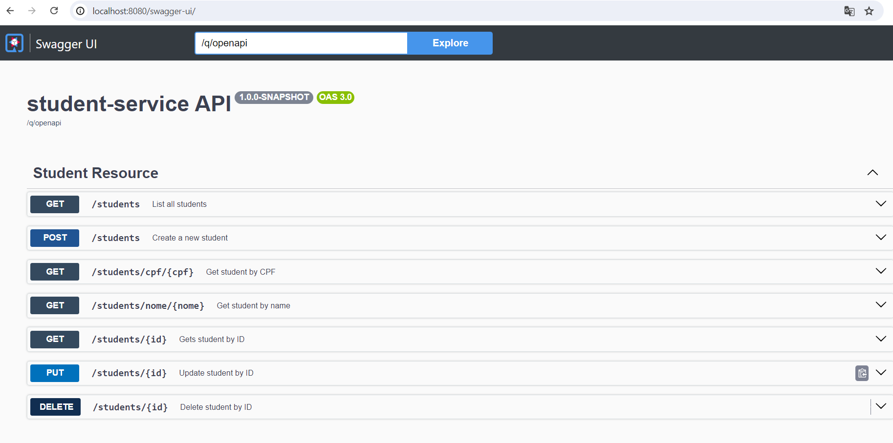

# Projeto Quarkus + Rota Camel + Kafka

## Descrição

Este projeto é composto por dois microserviços desenvolvidos em Quarkus, que se comunicam via Apache Kafka. O microserviço Students é uma API REST que consome mensagens de um tópico Kafka, enquanto o segundo microserviço é uma rota Camel que lê dados de um arquivo CSV e os publica em um tópico Kafka.

## Estrutura do Projeto

- **api-rest**: Microserviço que expõe uma API REST e consome mensagens de um tópico Kafka.
- **camel-producer**: Microserviço que lê dados de um arquivo CSV e publica mensagens em um tópico Kafka.

## Pré-requisitos

- Docker
- Docker Compose

## Como executar

1. Clone o repositório:

   ```sh
   git clone https://github.com/JotaNas/ProjectCamelKafka
## Como executar

2. Execute o Docker Compose:

   ```sh
   docker-compose up

## Acesse a interface do Swagger para a API REST:

Abra o navegador e vá para `http://localhost:8080/swagger-ui`.

## Endpoints da API

- `GET /students`: Retorna a lista de estudantes.
- `POST /students`: Adiciona um novo estudante.
- `PUT /students/{id}`: Edita o estudante.
- `DELETE /students/{id}`: Deleta o estudante.
- `GET /students/{id}`: Retorna um estudante específico.
- `GET /students/{cpf}`: Retorna um estudante pelo cpf.
- `GET /students/{nome}`: Retorna estudantes por nome.


## Imagem do Swagger

Abaixo está uma imagem do Swagger UI funcionando:



## Configuração do Kafka

O `docker-compose.yml` configura um contêiner Kafka que é usado pelos microserviços para comunicação.

## Estrutura do Arquivo CSV

O arquivo CSV deve estar localizado na pasta `/src/main/resources/IN` e deve ser copiado para `target/quarkus-app/IN`(o mesmo para o diretório /OUT) e  ter o seguinte formato:

```bash
Fulano da Silva,1990-05-15,35368303076
Ciclano Oliveira,1995-10-20,77846275054
Beltrano Souza,1988-03-08,05776727030
```

## Tecnologias Utilizadas

- Quarkus
- Apache Kafka
- Apache Camel
- Docker
- Docker Compose

## Licença

Este projeto está licenciado sob a Licença MIT. Veja o arquivo `LICENSE` para mais detalhes.

